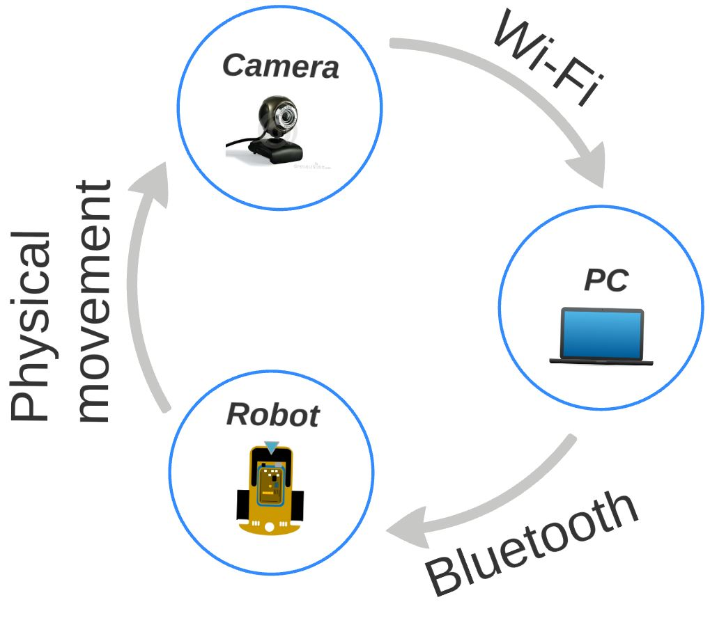

# RTT_G
## The Autonomous Sign Detector and Object Tracker Robot

*Keywords: differential drive robot, real-time image processing, GUI, Arduino, PCB design, motor control.*

The project includes the construction of a robot with differential drive, itsʼ control mechanism and machine vision based guidance. The robot is controlled by an ATmega2560 microcontroller on an Arduino development board. Itsʼ structure also contains the following elements: sensor-electronics, two DC motors, two accumulators, one servo motor, vision system with active illumination and one Bluetooth module. A proprietary interface card connects the microcontroller with the sensors and the interveners.
The strategic level guidance is accomplished with an application running on PC based architecture. The PC and the robot communicate with each other via Bluetooth. The robot can work in two modes: first one is the manual control mode, the second one is the autonomous mode.
First program is the manually operated mode, in which the user can guide the robot using the PCʼs keyboard. The second program implements autonomous guidance. In this mode, PC controls the robot based on the result of processing a video feed from a mobile phone mounted onto the robot. Image processing is performed on the PC using Emgu CV which is based on the OpenCV libraries.

https://www.youtube.com/watch?v=aYvZUBr8wPQ

## Installing Arduino IDE
* [Windows install](https://www.arduino.cc/en/guide/windows)
* [Linux](https://www.arduino.cc/en/guide/linux)
* [MAC](https://www.dummies.com/computers/arduino/how-to-install-arduino-for-mac-os-x/)

## Arduino projects
* R_TTG_IMG_Proc_9_Serial - Robot is controlled with a Machine Vision program
* R_TTG_Timers_Encoder_test_PID_4 - Robot is controlled with keyboard

## License
RTT_G code is a public domain work, dedicated using CC0 1.0. Feel free to do whatever you want with it.
